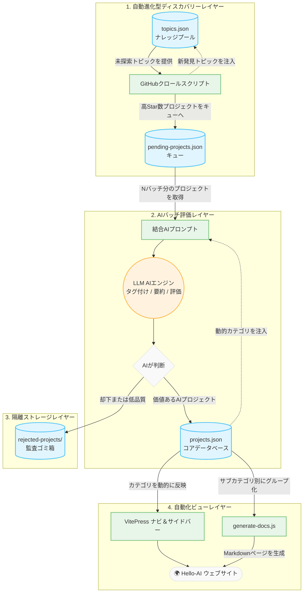

<div align="center">
  
  <h1>Hello-AI</h1>
  <p>高品質なオープンソースプロジェクトを自動更新するインテリジェントなディレクトリ。</p>
</div>

<div align="center">

[](https://hello-ai.anzz.top)
[](./LICENSE)
[](https://github.com/xxxily/hello-ai)
[](https://nodejs.org/)

</div>

<div align="center">
  <b><a href="./README.md">English</a></b> | <b><a href="./README-zh.md">中文文档</a></b> | 日本語
</div>

---

<!-- STATS_START -->
## 📊 プロジェクト統計

*インターネットから収集した高品質なオープンソースAIプロジェクトの概要：*

- 📁 **総収集数**: 17953 プロジェクト
- ⚡ **アクティブ表示数**: 8408 プロジェクト（過去6ヶ月以内に更新）
- 🏷️ **カテゴリ（アクティブ / 合計）**:
  - 🔥 トレンド: 30 / 30
  - 🧠 基盤モデル: 144 / 542
  - 🤖 エージェント＆オーケストレーション: 1197 / 1525
  - 🔍 RAG＆データエンジニアリング: 380 / 614
  - ☁️ インフラ＆デプロイ: 865 / 1444
  - 🔧 ファインチューニング＆学習: 343 / 878
  - 👁️ マルチモーダル（音声/動画）: 823 / 2653
  - 🛠️ 開発ツール＆SDK: 1859 / 3158
  - 🎨 AIアプリケーション: 791 / 1488
  - 📚 学習リソース: 1158 / 4026
  - 💻 デスクトップ＆OSアプリ: 236 / 329
  - 🦾 ロボティクス＆IoT: 462 / 1021
  - 💼 ビジネス＆金融: 162 / 307
- 📅 **最終更新日**: 2026-04-24
<!-- STATS_END -->

## 概要

**Hello-AI** は、**オープンソースAIプロジェクトのためのインテリジェントなAI駆動型ナビゲーションハブ** です。

AIが急速に進化する時代において、開発者はGitHubリポジトリの膨大な海を航行する際に「情報過多」に直面しがちです。Hello-AIは **AIエージェントの自動化** を活用し、グローバルなオープンソースコミュニティから最も高品質なAIリソースを発見・評価・整理します。

### ✨ 主な特徴

- 🤖 **自律的スマートメンテナンス**: 手動で管理される従来のリンクディレクトリとは異なり、Hello-AIはAIエージェントを使用して24時間365日、プロジェクトの発見・品質評価・分類を自律的に行います。まさに「AIがAIを発見する」仕組みです。
- 🗺️ **進化するランドスケープマップ**: 基盤モデル、エージェントフレームワーク、RAG、インフラ、マルチモーダルアプリ、開発ツールを幅広くカバーし、正確かつ直感的に整理されています。
- 🔄 **動的アクティビティ追跡**: システムは自動的に古くなったプロジェクトを除去し、Star数やヘルスステータスを動的に更新することで、最も関連性が高くアクティブなリポジトリのみを表示します。
- ⚡ **即座に価値を把握**: AIがすべてのリポジトリに対して簡潔な概要とユースケースを自動生成するため、手動調査を省略して数秒で最適なツールを特定できます。

これは、AIの最前線を探索し、究極の生産性ツールを見つけるためのショートカットです。

## 🏗️ アーキテクチャと実行ロジック

本プロジェクトは、自動化スクリプトと大規模言語モデルの連携によって完全に運用されています。以下は、発見からフロントエンドレンダリングまでの完全なデータライフサイクルを示すフローチャートです：



コアメカニズム、データフロー、システムアーキテクチャの詳細は以下の通りです：

### 1. 動的自動進化型ディスカバリーレイヤー
- **トピックマイニング:** `data/topics.json` の事前定義されたシードリストを使用し、クローラーがGitHub APIを巡回します。「最も長く探索されていない」トピックを優先的に選択し、`Stars >= 500` の新しいリポジトリを検索します。
- **ナレッジベースの拡張:** 新しく取得したプロジェクトから未知のトピックが検出されると、システムは自動的にそれらを「レベル2」（二次探索対象）として `topics.json` に登録します。
- **ペンディングキュー:** 発見されたすべての新しいリポジトリは、検証のために `data/pending-projects.json` に直接流れ込みます。

### 2. ローカル/クラウドAIバッチ評価エンジン
- **並行バッチ処理:** コアスクリプト `discover-and-evaluate.js` は、設定された数（`EVALUATE_BATCH_SIZE` 経由）のアイテムをペンディングプールから取り出し、LLM用の結合プロンプトを作成します。このバッチ設計により、APIの頻度制限を大幅に削減し、トークンコンテキストを再利用できます。
- **動的カテゴリルーティング:** システムはカテゴリを「ハードコード」しません。各評価時に、`data/projects.json` から有効なカテゴリとサブカテゴリを動的に読み取り、AIにプロジェクトを適切にルーティングするよう指示します。
- **タグ付けと監査:** AIは自動的にタグを抽出し、最適な中国語の説明を生成し、最も適切なサブカテゴリにプロジェクトを割り当てます。AIが不適格または分類不能と判断したアイテムは、隔離監査ログ（`data/rejected-projects/`）に破棄されます。
- **客観的トレンドリスト:** 日次の客観的計算により、Star数が最も多く最近更新されたトップ30プロジェクトが強制的に再計算され、自動的に `🔥 トレンド` カテゴリに配置されます。これによりAIのランダム性を上書きします。

### 3. 自動フロントエンドレンダリングとビューの分離
- **適応型ルーティング表示:** VitePressで構築されており、ナビバーとサイドバーは静的マッピングから書き直されています。`projects.json` にカテゴリが追加または削除されると、VitePressコンパイラが動的に分析し、UIを完璧にレンダリングするため、データとUIの不整合を防ぎます。
- **スマートMarkdownフォールディングと古いデータのクリーンアップ**: `generate-docs.js` はカテゴリを巡回し、アイテムをサブカテゴリ別にグループ化します。また、`RECENCY_THRESHOLD_MONTHS` 設定に基づいて、長期間更新されていないプロジェクトを自動的に除去し、高いプロジェクト品質を維持します。

### 4. 自動化パイプライン
- ハンズフリーの継続的発見（例：レート制限の回避）を実現するために、`scripts/loop-eval.js` のようなプロセスデーモンスクリプトを利用できます。これは連続スリープループを活用し、**発見 -> バッファリング -> AI評価 -> 静的ページビルド** の永続的なクローズドループ運用を実現し、オープンソースコードの海を無限に探索し続けます。

---

## 🚀 ローカルデプロイ＆実行ガイド

この自動拡張型AIナレッジベースフレームワーク全体をローカルで実行することを歓迎します！開始は非常に簡単です：

### 1. 環境とセットアップ
Node.js環境が必要です（v18.x以上を推奨）。
```bash
git clone https://github.com/xxxily/hello-ai.git
cd hello-ai
npm install
```

### 2. 環境変数の設定
テンプレートからコピーします：
```bash
cp .env.example .env
```
`.env` を開き、コア設定を調整します：
- **`GITHUB_TOKEN=`** `（強く推奨）`: 匿名のGitHub検索APIコールに適用される厳格なレート制限を回避します。
- **`LLM_API_KEY=`**: 対象のLLM APIキー（プロジェクトの分析とキュレーションに使用）。
  - *💡 ゼロコストのヒント: ローカルLLMセットアップ（例：Ollama経由のllama3）を使用している場合、`LLM_API_KEY=local-fallback` と設定するだけでOKです。*
- **`LLM_PROVIDER=`**: 組み込みのプロバイダープリセットを選択（`openai`、`minimax`、`deepseek`、`ollama`）。省略時は `LLM_BASE_URL` またはプロバイダー固有のAPIキー環境変数から自動検出されます。
- **`LLM_BASE_URL=`**: LLMエンドポイント（例：`https://api.openai.com/v1`、またはローカル `http://127.0.0.1:11434/v1`）。
- **`LLM_MODEL=`**: 使用する標準モデルID（例：`gpt-4o-mini`、`MiniMax-M2.5`）。
- **`DISCOVER_BATCH_SIZE`** / **`EVALUATE_BATCH_SIZE`** / **`UPDATE_STATUS_BATCH_SIZE`**: GitHubからの取得数、LLMプロンプトあたりの数、ステータス更新バッチの制限を変更します。
- **`LOOP_INTERVAL_SECONDS`**: 連続する `ai:loop-eval` サイクル間の基本アイドル時間間隔を設定します（デフォルト：60秒）。
- **`MAX_PAGES_DEFAULT`**: トピックあたりの探索最大ページ数のデフォルト（デフォルト：5）。
- **`MAX_PAGES_QUALITY`**: 高品質トピックの最大ページ数（デフォルト：20）。
- **`QUALITY_TOPIC_THRESHOLD`**: 高品質トピックのスコア閾値（デフォルト：5）。
- **`AUTO_FETCH_DESC_STARS`**: 欠落した説明を事前取得するためのStar数閾値（デフォルト：1000）。
- **`RECENCY_THRESHOLD_MONTHS`**: ドキュメント生成時に直近Nヶ月以内に更新されたプロジェクトのみを保持します（デフォルト：24、つまり2年）。

#### サポートされているLLMプロバイダー

評価エンジンは **OpenAI互換** のあらゆるLLM APIをサポートしています。組み込みプリセットにより簡単に切り替えできます：

| プロバイダー | `LLM_PROVIDER` | デフォルトモデル | APIキー環境変数 |
|----------|----------------|---------------|-------------|
| [OpenAI](https://openai.com) | `openai` | `gpt-4o-mini` | `OPENAI_API_KEY` または `LLM_API_KEY` |
| [MiniMax](https://www.minimaxi.com) | `minimax` | `MiniMax-M2.5` | `MINIMAX_API_KEY` または `LLM_API_KEY` |
| [DeepSeek](https://deepseek.com) | `deepseek` | `deepseek-chat` | `DEEPSEEK_API_KEY` または `LLM_API_KEY` |
| [Ollama](https://ollama.ai)（ローカル） | `ollama` | `llama3` | なし（`local-fallback` を使用） |

**MiniMaxでクイックスタート:**
```bash
LLM_PROVIDER=minimax
MINIMAX_API_KEY=your-key-here
# 特定のモデルを選択する場合（オプション）:
# LLM_MODEL=MiniMax-M2.7
```

### 3. 自動化パイプラインの実行
スクリプトの実行方法を選択してください：
- **単発手動実行**:
  ```bash
  npm run ai:discover-eval
  ```
- **常駐バックグラウンドデーモン**（継続的なフェッチ＆評価）:
  ```bash
  npm run ai:loop-eval
  ```
- **インタラクティブTUIデーモン**（手動パラメータ選択におすすめ）:
  ```bash
  npm run ai:loop-eval-tui
  ```
- **増分ステータスチェック**（評価済みアイテムのGitHub Star数＆ヘルスステータスをサイレントに確認/更新するバックグラウンドプロセス）:
  ```bash
  npm run ai:update-status
  ```
- **アクティブプロジェクトの再評価**（最新のサブカテゴリマッピングに追従するため、アイテムをキューに戻す）:
  ```bash
  npm run ai:re-evaluate-all
  ```
- **キューの消費＆終了**（レート制限を避けるためGitHub APIにpingせずキューを厳密に評価、空になったら自動終了）:
  ```bash
  npm run ai:consume-queue
  ```

#### 💡 高度なCLIフラグ
`npm run ai:discover-eval` またはそのバリアントを実行する際に、以下のフラグを追加できます：
- `--sort-topic-by=quality|time`: 
  - `quality`: 品質スコアが最も高いトピック（既に含まれているプロジェクトに基づく）を優先的に探索します。
  - `time`: 最も長く探索されていないトピックを優先的に探索します。
- `--topic-order=asc|desc`: ソート方向（デフォルト：Qualityの場合はDesc、Timeの場合はAsc）。
- `--consume-only`: ローカルキューのアイテムのみを評価し、新しいGitHub検索をスキップします。
- `--resume`: 最後に保存されたトピックとページから発見を再開します。
- `--update-only`: LLM評価なしで既存プロジェクトを一括更新します。
- `--init-topics`: （一回限り）`projects.json` の既存データに基づいてトピック品質スコアを再初期化します。

### 4. 動的ページ生成＆ローカルプレビュー
AIが評価を完了しコアデータバンクに保存した後、結果をローカルでプレビューできます！
```bash
# projects.jsonデータベースを巡回し、サブカテゴリ別にグループ化して個別のMarkdownドキュメントを自動レンダリング
npm run ai:generate-docs

# ローカルVitePressウェブサーバーを起動（新しく追跡されたプロジェクトでライブリロード）
npm run docs:dev

# プロダクションサイトデプロイ用のビルド成果物を生成（docsフォルダ配下）
npm run docs:build
```

---

## 🌟 AIプロジェクトを探索する

このサイトのナビゲーションバーまたはサイドバーを使って、AIエージェントが丹精込めてキュレーションしたオープンソースコードのオアシスを閲覧してください。
クローラーとスコアリングモデルが定期的にGitHubのトレンドプロジェクトをスキャンし、このディレクトリを常に最新に保ちます！

📚 **オンラインで閲覧: [https://hello-ai.anzz.top](https://hello-ai.anzz.top)**

## ディスカッショングループ

> AIチャットグループ。一部ではAIとの直接チャット体験を提供しており、志を同じくする方々とアイデアを交換できるプラットフォームです。

| Telegramグループに参加 | WeChatグループに参加（備考：AIグループに参加） |
| :----: | :----: |
|  |  |

> WeChatグループへの参加希望の際は、意図を明記してください。不要な招待や情報の迷惑行為を避けるためです。  
> Telegramグループリンク: [https://t.me/auto_gpt_ai](https://t.me/auto_gpt_ai)  

<p align="center">
  <a href="https://trackgit.com">
  
  </a>
</p>
