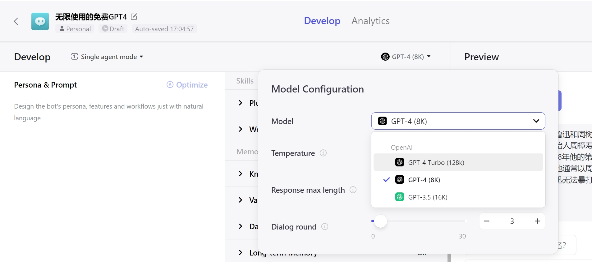

# Hello-AI

 
 

 
 

> 这是个帮助自己链接到广阔AI世界的项目，也希望能帮助到你。

## 概述

帮助自己也让更多人链接到AI世界，这是这个项目的初衷。  

作为AI降临派的带路者之一，在[ChatGPT](https://chat.openai.com/)最火热的时候，本着拒绝被割韭菜的初心，也曾提供了一系列公益的AI服务，帮助了一部分人链接上了AI世界。时光荏苒，如今AI已经遍地开花，曾经的公益服务也因为各种原因停止了。但是，这个项目的初衷还在，如果你厌倦了跟国内的那些套壳、不定时跑路、莫名失踪的AI服务斗智斗勇，那么这里或许依然能给你一些微弱的帮助。

项目会提供AI相关的资源，包括但不限于：

- ~~[免费ChatGPT网站列表](./home/FreeChatGPTSiteList.md)~~
- [ChatGPT中文调教指南](./home/chatgptPrompts.md)
- [ChatGPT开源项目合集](./home/awesome-open-gpt.md)
- [科学上网工具推荐](./home/airport.md)
- [全球AI网站汇总](./home/navigation.md)
- ~~[AI相关的影视作品](./home/film.md)~~
- ~~[AI相关的书籍](./home/books.md)~~
- AI相关的热门资讯
- AI信息交流群等

目前项目是利用业务时间维护的，所以会有疏漏、错误、体验不佳等问题，作者会尽量不断优化、完善。  

如果您有任何跟AI相关的信息欢迎提供，有建议或意见也可以提 [issue](https://github.com/xxxily/hello-ai/issues)

## 最新免费AI服务网站推荐

鉴于国内并不能稳定、合规、真实地提供[ChatGPT](https://chat.openai.com/)、[Gemini](https://gemini.google.com)等先进的AI服务，所以这里优先推荐国外服务商提供的AI服务。  

下面网站，如果访问受限，请参考：[科学上网](./home/airport.md)的相关内容。

### [coze.com](https://www.coze.com/) 推荐指数：⭐⭐⭐⭐⭐

推荐理由：

- 支持GPT-4模型，且无限使用
- 最高支持GPT-4(128K)模型
- 现阶段完全免费，暂无严格的注册限制
- 提供跟chatGPT-plus用户类似的服务
- 插件、知识库、联网等功能一个都不少
- 可以很方便地接入到国外主流聊天工具
- `由字节海外团队提供，服务质量和稳定性都有保证`
- `由字节海外团队提供，服务质量和稳定性都有保证`
- `由字节海外团队提供，服务质量和稳定性都有保证`

使用条件：

- 需要[梯子/魔法/科学上网](./home/airport.md)，
- 上面已经给出了科学上网服务商，不要再在群里问了，求求了，只能帮到这了
- 其它不懂的可以多谷歌，答案都有
- 有梯子的请忽略，咱真不是为推荐梯子而来的
- 答案都怼脸上了还是不知道怎么链接AI，就真没办法了。。。

### [chat.openai.com](https://chat.openai.com/) 推荐指数：⭐⭐⭐⭐⭐

推荐理由：

- GPT-3.5模型免费且无限使用
- OpenAI官方提供的ChatGPT服务
- 注册门槛已降低很多了，稍微折腾下基本都能注册成功
- 经过不断打磨，已经可以稳定流畅使用了
- 别再用国内的套壳了，那些真的很难用

使用条件：

- 需要[梯子/魔法/科学上网](./home/airport.md)，
- 上面已经给出了科学上网服务商，不要再在群里问了，求求了，只能帮到这了
- 其它不懂的可以多谷歌，答案都有
- 有梯子的请忽略，咱真不是为推荐梯子而来的
- 答案都怼脸上了还是不知道怎么链接AI，就真没办法了。。。

### [gemini.google.com](https://gemini.google.com/) 推荐指数：⭐⭐⭐⭐⭐

推荐理由：

- Google官方提供的AI服务
- 是目前在AI领域最有可能撼动OpenAI地位的AI服务商
- Gemini Ultra模型对标甚至超越GPT-4
- Gemini Ultra模型目前可免费试用两个月
- Gemini pro模型无限免费试用，智能程度堪比GPT-3.5

使用条件：

- 需要[梯子/魔法/科学上网](./home/airport.md)，
- 上面已经给出了科学上网服务商，不要再在群里问了，求求了，只能帮到这了
- 其它不懂的可以多谷歌，答案都有
- 有梯子的请忽略，咱真不是为推荐梯子而来的
- 答案都怼脸上了还是不知道怎么链接AI，就真没办法了。。。

### [sora](https://openai.com/sora) 推荐指数：⭐⭐⭐⭐⭐

推荐理由：

- 目前最火的文生视频AI应用，由OpenAI提供
- 能生成长达60秒的视频内容
- 生成的视频内容连贯、逼真
- 是目前市面上的任意文生视频AI都无法企及的

附注说明：

- 现阶段还没对普通用户开放使用
- 请不要妖魔化它，理智看待技术发展
- 请对新生事物保持期待和包容的心态

[Sora的技术研究报告文档](https://openai.com/research/video-generation-models-as-world-simulators)

## 交流群

> AI闲聊群，部分群组提供直接跟AI对聊的体验服务，可和更多志同道合的人交流讨论。  

| 加电报群（Telegram） | 加微信群（需注明：进AI群） |
| :----: | :----: |
|  |  |

> 微信群不注明要进群，则不会邀你入群，避免给你造成信息骚扰  
> 电报群地址：[https://t.me/auto_gpt_ai](https://t.me/auto_gpt_ai)  

  

