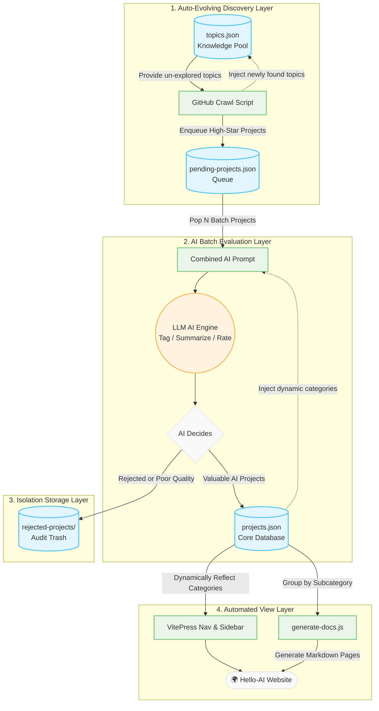

<div align="center">
  
  <h1>Hello-AI</h1>
  <p>An intelligent, auto-updating directory of high-quality open-source projects.</p>
</div>

<div align="center">

[](https://hello-ai.anzz.top)
[](./LICENSE)
[](https://github.com/xxxily/hello-ai)
[](https://nodejs.org/)

</div>

<div align="center">
  English | <b><a href="./README-zh.md">中文文档</a></b>
</div>

---

<!-- STATS_START -->
## 📊 Project Statistics

*Summary of high-quality open-source AI projects collected from the internet:*

- 📁 **Total Collected**: 16407 projects
- ⚡ **Active Shown**: 7661 projects (updated within the last 6 months)
- 🏷️ **Categories (Active / Total)**:
  - 🔥 Trending: 30 / 30
  - 🧠 Foundation Models: 119 / 500
  - 🤖 Agents & Orchestration: 1067 / 1361
  - 🔍 RAG & Data Engineering: 350 / 555
  - ☁️ Infrastructure & Deployment: 819 / 1350
  - 🔧 Fine-tuning & Training: 337 / 846
  - 👁️ Multimodal (Audio/Video): 760 / 2312
  - 🛠️ Developer Tools & SDKs: 1667 / 2877
  - 🎨 AI Applications: 694 / 1333
  - 📚 Learning Resources: 1086 / 3802
  - 💻 Desktop & OS Apps: 218 / 303
  - 🦾 Robotics & IoT: 414 / 920
  - 💼 Business & Finance: 142 / 279
- 📅 **Last Updated**: 2026-04-03
<!-- STATS_END -->

## Overview

**Hello-AI** is an **intelligent, AI-driven navigation hub for open-source AI projects.**

In an era of rapid AI evolution, developers often face "information overload" when navigating the vast sea of GitHub repositories. Hello-AI leverages **AI Agent automation** to discover, evaluate, and organize the most high-quality AI resources from the global open-source community.

### ✨ Key Features

- 🤖 **Autonomous Smart Maintenance**: Unlike traditional link directories maintained manually, Hello-AI uses AI agents for 24/7 autonomous project discovery, quality assessment, and categorization. It's "AI discovering AI."
- 🗺️ **Evolutionary Landscape Map**: Deep coverage across foundational models, Agent frameworks, RAG, infrastructure, multimodal apps, and dev tools—organized precisely and intuitively.
- 🔄 **Dynamic Activity Tracking**: The system automatically purges stale projects and dynamically updates Star counts and health status, ensuring you only see the most relevant and active repositories.
- ⚡ **Instant Value Insights**: AI automatically generates concise summaries and use-cases for every repository, allowing you to bypass manual research and identify the right tools in seconds.

This is your shortcut to exploring the boundaries of AI and finding the ultimate productivity tools.

## 🏗️ Architecture & Execution Logic

This project operates entirely through the collaboration of automated scripts and Large Language Models. Below is a visual flowchart demonstrating the complete data lifecycle—from discovery to frontend rendering:


```mermaid
graph TD
    classDef default fill:#f9f9f9,stroke:#e0e0e0,stroke-width:1px;
    classDef database fill:#e1f5fe,stroke:#4fc3f7,stroke-width:2px;
    classDef ai fill:#fff3e0,stroke:#ffb74d,stroke-width:2px;
    classDef process fill:#e8f5e9,stroke:#81c784,stroke-width:2px;
    
    subgraph Discovery [1. Auto-Evolving Discovery Layer]
        T[(topics.json<br/>Knowledge Pool)]:::database -->|Provide un-explored topics| Fetch[GitHub Crawl Script]:::process
        Fetch -.->|Inject newly found topics| T
        Fetch -->|Enqueue High-Star Projects| Q[(pending-projects.json<br/>Queue)]:::database
    end

    subgraph Evaluation [2. AI Batch Evaluation Layer]
        Q -->|Pop N Batch Projects| P[Combined AI Prompt]:::process
        DB[(projects.json<br/>Core Database)]:::database -.->|Inject dynamic categories| P
        P --> LLM((LLM AI Engine<br/>Tag / Summarize / Rate)):::ai
        LLM --> Condition{AI Decides}
    end

    subgraph Storage [3. Isolation Storage Layer]
        Condition -->|Rejected or Poor Quality| R[(rejected-projects/<br/>Audit Trash)]:::database
        Condition -->|Valuable AI Projects| DB
    end

    subgraph Frontend [4. Automated View Layer]
        DB -->|Dynamically Reflect Categories| Vite[VitePress Nav & Sidebar]:::process
        DB -->|Group by Subcategory| Gen[generate-docs.js]:::process
        Vite --> Site([🌍 Hello-AI Website])
        Gen -->|Generate Markdown Pages| Site
    end
```

Its core mechanism, data flow, and system architecture details are as follows:

### 1. Dynamic Auto-Evolving Discovery Layer
- **Topic Mining:** Using a predefined seed list in `data/topics.json`, the crawler iterates over the GitHub API, prioritizing the "least recently explored" topics to search for new repositories with `Stars >= 500`.
- **Knowledge Base Growth:** When unseen topics are detected from newly fetched projects, the system automatically registers them into `topics.json` as 'Level 2' (secondary exploration targets).
- **Pending Queue:** All discovered new repositories flow directly into `data/pending-projects.json` for validation.

### 2. Local/Cloud AI Batch Evaluation Engine
- **Concurrent Batch Processing:** The core script `discover-and-evaluate.js` pops a configured number of items (via `EVALUATE_BATCH_SIZE`) from the pending pool and creates a combined prompt for the LLM. This batch design drastically reduces API frequency limits and reuses token context.
- **Dynamic Category Routing:** The system never "hard-codes" categories. Upon each evaluation, it dynamically reads the valid categories and subcategories from `data/projects.json` and instructs the AI to route projects accordingly.
- **Tagging & Auditing:** The AI automatically extracts tags, generates optimal Chinese descriptions, and assigns the project to the most suitable subcategory. If an item is deemed unworthy or un-categorizable by the AI, it gets discarded into an isolation audit log (`data/rejected-projects/`).
- **Objective Trending List:** A daily objective calculation forces the recalculation of the top 30 highest-star, recently updated projects, automatically placing them into the `🔥 Trending` category, overriding AI randomness.

### 3. Automated Frontend Rendering & View Decoupling
- **Adaptive Routing Presentation:** Built with VitePress, the Navbar and Sidebar have been rewritten from static mappings. Whenever categories are added or removed from `projects.json`, the VitePress compiler dynamically analyzes it and renders the UI perfectly, preventing data-to-UI discrepancies.
- **Smart Markdown Folding & Stale Cleanup**: `generate-docs.js` iterates over categories, grouping items by subcategory. It also automatically purges projects that haven't been updated for a long time based on the `RECENCY_THRESHOLD_MONTHS` setting to maintain high project quality.

### 4. Automation Pipeline
- For hands-free, continuous discovery (e.g., avoiding rate-limit drops), you can utilize process daemon scripts like `scripts/loop-eval.js` which leverage continuous sleep loops. This achieves a permanent closed-loop operation of: **Discover -> Buffer -> AI Evaluate -> Static Page Build**, endlessly exploring the ocean of open source code.

---

## 🚀 Local Deployment & Running Guide

You are completely welcome to run this entire auto-expanding AI knowledge base framework locally! It is very simple to start:

### 1. Environment & Setup
A Node.js environment is required (v18.x or above is recommended).
```bash
git clone https://github.com/xxxily/hello-ai.git
cd hello-ai
npm install
```

### 2. Environment Variables Configuration
Copy from the template:
```bash
cp .env.example .env
```
Open `.env` and adjust the core configurations:
- **`GITHUB_TOKEN=`** `(Highly Recommended)`: Bypasses the strict rate limits applied to anonymous GitHub search API calls.
- **`LLM_API_KEY=`**: Your target LLM API Key (used for analyzing and curating projects).
  - *💡 Zero-Cost Prompt: If you are using a local LLM setup (e.g. Ollama via llama3), you can simply use `LLM_API_KEY=local-fallback`.*
- **`LLM_PROVIDER=`**: Select a built-in provider preset (`openai`, `minimax`, `deepseek`, `ollama`). When omitted, auto-detected from `LLM_BASE_URL` or provider-specific API key env vars.
- **`LLM_BASE_URL=`**: LLM endpoint (e.g. `https://api.openai.com/v1`, or local `http://127.0.0.1:11434/v1`).
- **`LLM_MODEL=`**: Standard model identity to use (e.g. `gpt-4o-mini`, `MiniMax-M2.5`).
- **`DISCOVER_BATCH_SIZE`** / **`EVALUATE_BATCH_SIZE`** / **`UPDATE_STATUS_BATCH_SIZE`**: Modify limits per pull from GitHub, per LLM prompt, and for status update batching.
- **`LOOP_INTERVAL_SECONDS`**: Configure the base idle time interval between consecutive `ai:loop-eval` cycles (default: 60s).
- **`MAX_PAGES_DEFAULT`**: Default max pages to explore per topic (default: 5).
- **`MAX_PAGES_QUALITY`**: Max pages for high-quality topics (default: 20).
- **`QUALITY_TOPIC_THRESHOLD`**: Score threshold for high-quality topics (default: 5).
- **`AUTO_FETCH_DESC_STARS`**: Star threshold to proactively fetch missing descriptions (default: 1000).
- **`RECENCY_THRESHOLD_MONTHS`**: Only projects updated within the last N months are kept during doc generation (default: 24, i.e., 2 years).

#### Supported LLM Providers

The evaluation engine supports any **OpenAI-compatible** LLM API. Built-in presets make it easy to switch:

| Provider | `LLM_PROVIDER` | Default Model | API Key Env |
|----------|----------------|---------------|-------------|
| [OpenAI](https://openai.com) | `openai` | `gpt-4o-mini` | `OPENAI_API_KEY` or `LLM_API_KEY` |
| [MiniMax](https://www.minimaxi.com) | `minimax` | `MiniMax-M2.5` | `MINIMAX_API_KEY` or `LLM_API_KEY` |
| [DeepSeek](https://deepseek.com) | `deepseek` | `deepseek-chat` | `DEEPSEEK_API_KEY` or `LLM_API_KEY` |
| [Ollama](https://ollama.ai) (local) | `ollama` | `llama3` | N/A (uses `local-fallback`) |

**Quick start with MiniMax:**
```bash
LLM_PROVIDER=minimax
MINIMAX_API_KEY=your-key-here
# Optionally pick a specific model:
# LLM_MODEL=MiniMax-M2.7
```

### 3. Run Automation Pipelines
Choose how you want to execute scripts:
- **Single Manual Execution**:
  ```bash
  npm run ai:discover-eval
  ```
- **Constant Background Daemon** (Continuous fetch & evaluate):
  ```bash
  npm run ai:loop-eval
  ```
- **Interactive TUI Daemon** (Recommended for manual param selection):
  ```bash
  npm run ai:loop-eval-tui
  ```
- **Incremental Status Check** (Background process to silently check/update GitHub star & health status for evaluated items):
  ```bash
  npm run ai:update-status
  ```
- **Re-Evaluate Active Projects** (Moves items back to Queue to catch up with latest sub-category mapping):
  ```bash
  npm run ai:re-evaluate-all
  ```
- **Consume Queue & Exit** (Strictly evaluates queue without pinging GitHub API to avoid rate-limits; auto-exits when empty):
  ```bash
  npm run ai:consume-queue
  ```

#### 💡 Advanced CLI Flags
When running `npm run ai:discover-eval` or its variants, you can append the following flags:
- `--sort-topic-by=quality|time`: 
  - `quality`: Prioritize exploring topics with the highest quality score (based on already included projects).
  - `time`: Prioritize exploring the least recently explored topics.
- `--topic-order=asc|desc`: Sorting direction (default: Desc for Quality, Asc for Time).
- `--consume-only`: Evaluates local queue items only, skipping new GitHub searches.
- `--resume`: Resumes discovery from the last saved topic and page.
- `--update-only`: Mass updates existing projects without LLM evaluation.
- `--init-topics`: (One-time) Re-initializes topic quality scores based on existing data in `projects.json`.

### 4. Dynamic Pages Generation & Local Preview
Once your AI has finished evaluating and saving into the core databank, preview the outcome locally!
```bash
# Iterates projects.json database, groups it into subcategories and auto-renders individual Markdown documents
npm run ai:generate-docs

# Boot local VitePress web server (live reloading with newly tracked projects)
npm run docs:dev

# Prepend distribution artifacts for production site deployment (under docs folder)
npm run docs:build
```

---

## 🌟 Explore AI Projects

Please use the navigation bar or sidebar of this site to browse this oasis of open-source code meticulously curated for you by our AI agent.
Our crawlers and scoring models regularly sweep GitHub for trending projects, keeping this directory fresh!

📚 **View Online: [https://hello-ai.anzz.top](https://hello-ai.anzz.top)**

## Discussion Groups

> AI chat groups, some of which offer direct chat experiences with AI, and a platform to exchange ideas with like-minded individuals.

| Join Telegram Group | Join WeChat Group (Note: Join AI group) |
| :----: | :----: |
|  |  |

> Please specify your intent to join the WeChat group to avoid unwanted invitations and information harassment.  
> Telegram group link: [https://t.me/auto_gpt_ai](https://t.me/auto_gpt_ai)  

<p align="center">
  <a href="https://trackgit.com">
  
  </a>
</p>
