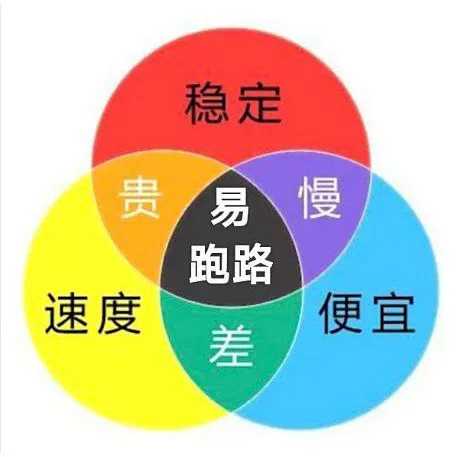

# 科学上网

> 在OpenAI和国内防火墙的内外夹击之下，科学上网成了连接AI的重要工具，如果你正在为寻找合适的梯子而焦头烂额，那么这里或许能给你些许帮助。

### 科学上网服务商推荐

暂时只推荐个人用过，且相对稳定的服务商，其他的服务商可以自行谷歌搜索：

| 服务商 | 按月最低套餐 | 按量最低套餐 | 稳定度 | 速度 | 适用场景 |
| :----: | :----: | :----: | :---- | :---- | :---- |
| [catnet](https://www.58catnet.com/#/register?code=zr0Nqcdq) | 25元/100G | 不支持 | ⭐⭐⭐⭐ | ⭐⭐⭐⭐ | 高质量网络 |
| [零点云](https://hd.vdoos.pw/auth/register?code=YMX5) | 13元/100G | 不支持 | ⭐⭐⭐ | ⭐⭐⭐ | 办公日常使用 |
| [AntLink](https://antlink.cc/#/register?code=IiwzN0HO) | 10元/208G | 12元/50G | ⭐⭐ | ⭐⭐ | 入门轻度使用 |

PS：没有绝对稳定的科学上网服务商，详细说明见下面的科普说明

### 科学上网快速扫盲

科学上网是指能让你的电脑或手机连接到访问受限网站的一种方式，例如要访问[ChatGPT官网](https://ai.com)，以及大部分[免费的ChatGPT平替或镜像网站](./FreeChatGPTSiteList.md)等，都需要科学上网。

科学上网的别称：

- 科学上网
- 魔法上网
- 梯子
- 代理
- 机场

所有的科学上网方式都是通过代理服务器来实现的，服务器是需要设备、运维等成本的，所以理论上都需要付费购买才能使用，当然为了吸引更多的用户，也有一些免费的科学上网方式，但是免费的科学上网方式一般都会有：不稳定，速度慢，不安全等问题。如果你不怕麻烦，不关心安全，也没有太高的使用要求，还有一定的折腾能力，那么尽可选择免费的科学上网方式，但是如果你只是想要一个稳定、安全、速度快的科学上网方式，付费购买是必然的选择。  

付费选购科学上网的经典三定律：

 
 

 
 

总结起来就是：

- 没有绝对可靠的科学上网方式，不要相信别人胡吹，便宜好用还不跑路都是骗人的
- 简单使用可选择便宜点的服务商提供的科学上网方式，但不要期望过高，卡慢或跑路是常态
- 希望又快又稳定的，费银子是必然的，还得选择到相对可靠的服务商才行，要不然也是打水漂
