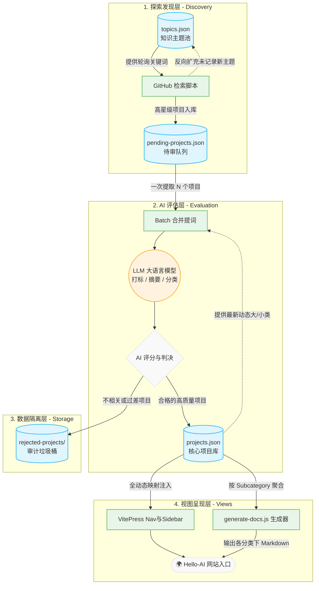

# Hello-AI

- 📚 **文档地址：[hello-ai.anzz.top](https://hello-ai.anzz.top)** (国际站)
- 📚 **文档地址：[hello-ai.anzz.site](https://hello-ai.anzz.site)** (国内站)
- 🏠 **项目地址：[github.com/xxxily/hello-ai](https://github.com/xxxily/hello-ai)**  

<br />
<br />

<div style="display: flex; justify-content: center; margin: 2rem 0;">
  
</div>

<br />

> 这是个帮助自己链接到广阔AI世界的项目，也希望能帮助到你。

<!-- STATS_START -->
## 📊 项目统计

*此项目已从互联网搜罗并收录了大量 AI 相关的优质开源项目，概况如下：*

- 📁 **合计收录**：16282 个项目
- ⚡ **活跃展示**：7556 个项目 (仅限最近 6 个月有活跃更新记录)
- 🏷️ **分类概览 (活跃 / 总数)**：
  - 🔥 热门推荐：30 / 30
  - 🧠 基础大模型：120 / 498
  - 🤖 智能体与编排：1048 / 1340
  - 🔍 RAG与检索：348 / 552
  - ☁️ 基础设施与部署：812 / 1341
  - 🔧 微调与训练：333 / 841
  - 👁️ 多模态与音视频：751 / 2305
  - 🛠️ 开发工具与SDK：1646 / 2856
  - 🎨 AI终端应用：685 / 1325
  - 📚 学习与资源：1066 / 3770
  - 💻 桌面与操作系统级应用：216 / 300
  - 🦾 机器人与物联网：404 / 908
  - 💼 商业与量化：139 / 277
- 📅 **最后更新**：2026-04-01
<!-- STATS_END -->

## 概述

帮助自己也让更多人链接到AI世界，这是这个项目的初衷。  

作为AI降临派的带路者之一，在ChatGPT最火热的时候，本着拒绝被割韭菜的初心，也曾提供了一系列公益的AI服务，帮助了一部分人链接上了AI世界。
时光荏苒，如今AI已经遍地开花，曾经的公益服务也因为各种原因停止了。但是，这个项目的初衷还在：**帮助自己也让更多人链接到AI世界！**

因此，本项目迎来了全新的 **2.0 重构方案**：我们不再直接提供AI基础服务，而是将注意力转移到浩如烟海的开源世界中。
本项目现在作为一个**智能更新的 AI 项目全景地图**，通过 AI 代理自动收集、评估、分类和追踪全球最新、最热的 AI 延伸项目（涵盖基础大模型、AI基础设施、智能体编排、RAG与数据工程、多模态等）。

**核心特色：**
- 🤖 **AI 自动化维护**：项目的收集、打标、过时清理，全部由 AI 代理和定时任务自动完成，实现“让AI帮助人类连接AI”。
- 📦 **全面分类整理**：让你不再错过开源社区里优秀的 AI 新生力量。
- 🔄 **持续追踪**：及时查漏补缺，剔除停更项目，动态跟进最新热门。

欢迎你在这里探索，发现提升效率的利器！

## 🏗️ 架构与执行逻辑

本项目完全依靠自动化脚本与大语言模型协同工作。以下是系统的可视化运行架构图，展示了从数据发现到前端渲染的完整数据流向：



其核心运行机制、闭环数据流与系统架构概况详细如下：

### 1. 动态自演进的数据发现层 (Discovery)
- **Topic 动态挖掘：** 借助 `data/topics.json` 中定义的主题种子列表，抓取引擎会按“最久未探索”的维度轮询 GitHub API 检索 `Stars >= 500` 的新仓库。
- **知识库自生长：** 当从爬取的项目中发现未曾见过的新 Topic，系统会自动将其登记进 `topics.json` 并标记为级别2（次级探索目标）。
- **待处理队列：** 发现的所有高可用全新仓库，都会流向待定池 `data/pending-projects.json` 准备受审。

### 2. 本地/云端 AI 批处理评估层 (Evaluation)
- **并发批量过审引擎：** 核心脚本 `discover-and-evaluate.js` 每次从待审池抽取定量批次（可通过环境变量 `EVALUATE_BATCH_SIZE` 配置，比如一次评价 5~10 个）构建出合并 Prompt 交给 LLM。这种批处理设计能复用 Token 与上下文，规避频繁的接口频率限制。
- **动态分类路由：** 系统绝不“硬编码”任何分类枚举。每次评估前都会动态读取主库 `data/projects.json` 中配置的有效 `categories` 与其子分类（Subcategories），将其注入 Prompt 指导 AI 做出归类。
- **打标与审计：** AI 自动生成短评、标签、大类小类标记并写入主数据流。对于不合格的、AI 判定无意义或无法对应分类的项，将被记录到专门的 `data/rejected-projects/` 隔离审计库之中。
- **客观热门榜单：** 每日客观计算，强制重算最近更新、Star最高的头尾 30 名项目，自动将其覆盖到 `🔥 热门推荐` 中。

### 3. 前端自动化渲染与视图解耦 (View Generation)
- **轻量级自适应路由呈现：** 本项目采用 VitePress 框架构建，其 Navbar (`nav`) 与 Sidebar (`sidebar`) 被完全改写为动态读取。当 `projects.json` 发生分类变动时，会自动抽取极简版的 `categories.json` 供前端导航按需加载。这既避免了由于大 json 造成的前端极慢解析，又能毫无迟滞地将最新分类精准呈递进前端侧边栏，避免数据与 UI 产生的视图错乱。
- **智能 Markdown 小类折叠与过时清理**：`generate-docs.js` 会自动遍历大类，并在生成各个大类文档页时，根据项目归属的 `subcategory` 将项目智能分组。同时，它会根据 `RECENCY_THRESHOLD_MONTHS` 配置自动剔除长期未更新的项目，确保文档的实效性与整体质量。

### 4. 自动化驱动引擎 (Automation Process)
- 为了追求无人值守的完美流线（比如规避访问限流），您可选用 `scripts/loop-eval.js` 等进程守护型执行器，通过内置的 `Sleep` 等轮询机制，长期维持 **发现 -> 暂存 -> AI评估 -> 静态页打包** 面向开源大海的探索闭环。

---

## 🚀 本地部署与运行指南

完全欢迎您在本地自己跑通这套基于大模型自动扩展整理的分类知识库。非常容易上手：

### 1. 环境准备与依赖安装
需要 Node.js 环境（推荐 18.x 及以上版本）。
```bash
git clone https://github.com/xxxily/hello-ai.git
cd hello-ai
npm install
```

### 2. 环境变量配置
复制一份环境配置模板并修改：
```bash
cp .env.example .env
```
用编辑器打开 `.env` 调整以下核心参数：
- **`GITHUB_TOKEN=`** `(强烈建议配置)`：搜索限流极高，不置为空很容易触发限流风控。
- **`LLM_API_KEY=`**：你的 大语言模型 API Key（用于分析和筛选项目）。
  - *💡 零成本本地提示：如果你在使用本地部署大模型（如 Ollama + llama3），可以将其设为 `local-fallback`。*
- **`LLM_PROVIDER=`**：选择内置供应商预设（`openai`、`minimax`、`deepseek`、`ollama`）。省略时会根据 `LLM_BASE_URL` 或对应的 API Key 环境变量自动检测。
- **`LLM_BASE_URL=`**：API转发地址（例如：`https://api.openai.com/v1` 或 本地 `http://127.0.0.1:11434/v1`）。
- **`LLM_MODEL=`**：要执行推理的模型名字（如 `gpt-4o-mini`、`MiniMax-M2.5`）。
- **`DISCOVER_BATCH_SIZE`** / **`EVALUATE_BATCH_SIZE`**：可控每次探索拉取的个数，及一次批量合并扔给 AI 判断的项目个数。
- **`LOOP_INTERVAL_SECONDS`**: 可调整 `ai:loop-eval` 循环模式每次休息的打底时间（默认 60 秒）。
- **`MAX_PAGES_DEFAULT`**: 每个话题默认探索的最大页数（默认：5）。
- **`MAX_PAGES_QUALITY`**: 高质量话题探索的最大页数（默认：20）。
- **`QUALITY_TOPIC_THRESHOLD`**: 判定为高质量话题的分数阈值（默认：5）。
- **`AUTO_FETCH_DESC_STARS`**: 自动获取缺失描述的 Star 阈值（默认：1000）。
- **`RECENCY_THRESHOLD_MONTHS`**: 文档生成时保留最近多少个月有更新的项目（默认：24，即 2 年）。

#### 支持的 LLM 供应商

评估引擎支持任何 **OpenAI 兼容** 的 LLM API，内置预设可方便切换：

| 供应商 | `LLM_PROVIDER` | 默认模型 | API Key 环境变量 |
|--------|----------------|----------|-----------------|
| [OpenAI](https://openai.com) | `openai` | `gpt-4o-mini` | `OPENAI_API_KEY` 或 `LLM_API_KEY` |
| [MiniMax](https://www.minimaxi.com) | `minimax` | `MiniMax-M2.5` | `MINIMAX_API_KEY` 或 `LLM_API_KEY` |
| [DeepSeek](https://deepseek.com) | `deepseek` | `deepseek-chat` | `DEEPSEEK_API_KEY` 或 `LLM_API_KEY` |
| [Ollama](https://ollama.ai) (本地) | `ollama` | `llama3` | 不需要（使用 `local-fallback`） |

**MiniMax 快速上手：**
```bash
LLM_PROVIDER=minimax
MINIMAX_API_KEY=your-key-here
# 可选指定模型：
# LLM_MODEL=MiniMax-M2.7
```

### 3. 开始执行自动化作业
您可以按照需求来跑跑脚本：
- **单次试运行**：
  ```bash
  npm run ai:discover-eval
  ```
- **开启无人守护循环模式** (推荐用于长久维护，持续探索+分类)：
  ```bash
  npm run ai:loop-eval
  ```
- **开启 TUI 交互配置循环模式** (推荐，可视化选择参数)：
  ```bash
  npm run ai:loop-eval-tui
  ```
- **后台增量更新 Star 数与存活状态** (拉取库内项目进行信息修正)：
  ```bash
  npm run ai:update-status
  ```
- **重置所有分类并重新评估** (这会将 projects 移回 pending 队列，方便新老标准对齐)：
  ```bash
  npm run ai:re-evaluate-all
  ```
- **快速消耗完待审队列并自动退出** (跳过发现环节，适合配合上面的重置操作，不触发 GitHub API 请求风控)：
  ```bash
  npm run ai:consume-queue
  ```
- **单独提取轻量级分类数据** (用于前端导航与侧边栏渲染，注意该脚本在执行更新后通常会自动触发)：
  ```bash
  npm run ai:extract-categories
  ```

#### 💡 进阶参数说明 (Advanced CLI Flags)
在执行 `npm run ai:discover-eval` 或其变体时，可追加以下参数：
- `--sort-topic-by=quality|time`: 
  - `quality`: 优先探索质量评分（基于已收录项目数）最高的主题。
  - `time`: 优先探索最后探索时间最久远的主题。
- `--topic-order=asc|desc`: 排序方向（默认质量降序/时间升序）。
- `--consume-only`: 仅从本地队列评估，不向 GitHub 发起新搜索。
- `--resume`: 恢复上次探索进度，从记录的主题和页码继续。
- `--update-only`: 仅更新现有项目统计信息，跳过 LLM 评估阶段。
- `--init-topics`: (仅限初始化) 根据 `projects.json` 已有数据重新初始化 `topics.json` 的质量评分。

### 4. 动态生成页面与本地阅览
等待 AI 完成打标写档后，可以一键将数据变回网站！
```bash
# 根据 projects.json 数据，生成各个大类的文档归组 Markdown
npm run ai:generate-docs

# 启动本地 VitePress Web 服务器（比如: 实时预览分类和数据）
npm run docs:dev

# 发布静态化预编译站点 (产出于 docs 目录下)
npm run docs:build
```

---

## 🌟 探索 AI 项目

请通过本站的系统导航，浏览这片由 AI 自动为你精选的开源代码绿洲。
我们的爬虫和打分模型会定期搜罗 GitHub 上的热门项目，保持这份目录的鲜活度！

- 📚 **在线访问：[hello-ai.anzz.top](https://hello-ai.anzz.top)** (国际站)
- 📚 **在线访问：[hello-ai.anzz.site](https://hello-ai.anzz.site)** (国内站)

## 交流群

> AI闲聊群，部分群组提供直接跟AI对聊的体验服务，可和更多志同道合的人交流讨论。  

| 加电报群（Telegram） | 加微信群（需注明：进AI群） |
| :----: | :----: |
|  |  |

> 微信群不注明要进群，则不会邀你入群，避免给你造成信息骚扰  
> 电报群地址：[https://t.me/auto_gpt_ai](https://t.me/auto_gpt_ai)  